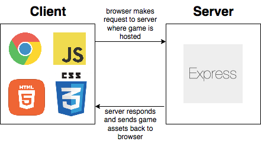

# KTSE

## Introduction
* MA final project for Game category
* Team of 5: Alfie, Charlene, Chris, Julian, Tom
* Our project focus is to come up with a well-designed game, as opposed to focusing on learning new technology or coming out with a polished marketable product.

## Game Concept
Katsu-to-SpaceEx (KTSE)* is a strategic survival simulation (SSS) game where a player must complete a 12-cycle educational bootcamp course to secure the best job possible. Each cycle, the player has a set number of Action Points (AP) to perform actions which will influence their Energy level (EL) and/or Project Quality (PQ).
* EL must remain above 0 for the player to continue playing and the lower the EL, the higher the AP cost is to perform actions.
* The higher the PQ, the better the job the player secures at the end of the game.
* The player must manage random events and decision-points which will affect them in various ways.
* The player can interact with Non-Playable Characters (NPCs) who may, within limits, offer bonus effects to support the player’s performance.

## Architecture Model

## Domain Model

## Project Approach

- Daily standups to assess the mood and prioritise what tasks need doing, distributing workload among ourselves
- Daily retros of what went well, what didn't go well, what we should start doing and stop doing
- Optionally, if anyone wanted to work beyond 'office hours', this would be communicated during the retro or via Slack. This was to prevent two people working independently on the same aspect

## Project Kick Off
* Brainstorming (generated 6 ideas)
* Voting - round 1 (down-selected to 3 ideas)
* Define high-level MVP (improve understanding)
* Voting - round 2 (down-selected to 1 idea)
* Define overarching game concept (objective, features, high level mechanics)
* Refine MVP

## Tech Stack
* Primary Language: <del>C#</del> **Javascript**
* Test Framework: **Mocha, Chai, Zombie**
* Web Application Framework: **Express**

We made our decision to go with these technologies via:
* Online research
* Seeking advice from coaches
* Seeking advice from MA alumni
* Seeking advice from expert game developers

## C# vs Javascript
When deciding what technologies we wanted to create our game in, we had an interesting segway at the start of our project to attempt to create our game in C#. Reasons for this included:

- C# is a popular language in the gamedev industry
- Availability of libraries and frameworks such as Unity and XNA/MonoGame
- The challenge of learning another language

However, after a day and a half of setting up our developer environment, we decided to make the move back to JavaScript as the software and utilities available to those using a Mac were immature compared to their Windows counterparts. Visual Studio also has UI differences between the two operating systems, causing further confusion as used tutorials as an aid to attempt to gain a foothold in making a start on the language.

We did manage to get sprites working and a game building and running successfully using the MonoGame framework - and some of our members are considering revisiting C# post-course on our Windows environments to work on a game as a side project.

## Project Management
- Communication: Slack
- Task management: Trello  
- Knowledge management: GitHub Wiki